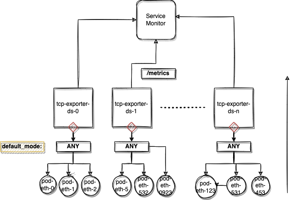

# tcp-exporter


This is a project that contains important tcp metrics like Retransmission, window scale, rst, ip_defragmentation ..etc 

You are able to run this metric exporter in all the components which is interacting with network in anyhow.

This metric exporter is responsible to listen interfaces on the workload and produce metrics based on the analysis.

**Table of Contents**

- [How to deploy](#how-to-deploy)
- [Prometheus Metrics](#prometheus-metrics)
    - [List of Metrics](#list-of-metrics)
    - [Grafana Dashboard](#grafana-dashboard)


## How to deploy

### Kubernetes

To deploy this tcp exporter you can follow up these commands show at below;

```sh

    pushd k8s
        helm upgrade -i <RELEASE-NAME> -f values.yaml .
    popd

```
This helm chart deploy a daemonset which is running in `hostNetwork: true` mode.This allows us to track all the activities of the interfaces in and out cluster connectivity. 

## Concept

</img>

As you can see the illustrated images this daemonsets fetches all the pcap data of each interface as you can image each data processing by the tcp-exporter and it produce analys for each pod interface and ip traffic as well.

## Prometheus Metrics

Metrics example this metric exporter works like that;

```sh
    #!/bin/bash

    pushd tcp-exporter
        go build .
        ./tcpdump_exporter -p 9090 -i eni-123123 -f tcp
    popd
```

After you build and run this application it will start to produce metrics like that;

### List of the Metrics

```sh
# TYPE duration_metric counter
duration_metric{dstIp="<<DST_IP_ADDR>>",srcIp="<<SRC_IP_ADDR>>"} 3.0313016523275064e+18
...
..
.
# TYPE retransmission_metric counter
retransmission_metric{dstIp="<<DST_IP_ADDR>>",srcIp="<<SRC_IP_ADDR>>",deviceName="<<NET_DEVICE_NAME>>" } 12
window_scale_metric{dstIp="<<DST_IP_ADDR>>",srcIp="<<SRC_IP_ADDR>>", deviceName="<<NET_DEVICE_NAME>>",} 5.0
rst_metric{dstIp="<<DST_IP_ADDR>>",srcIp="<<SRC_IP_ADDR>>", deviceName="<<NET_DEVICE_NAME>>",} 3.0
ip_df_metric{dstIp="<<DST_IP_ADDR>>",srcIp="<<SRC_IP_ADDR>>", deviceName="<<NET_DEVICE_NAME>>",} 1.2
zerowindow_metric{dstIp="<<DST_IP_ADDR>>",srcIp="<<SRC_IP_ADDR>>", deviceName="<<NET_DEVICE_NAME>>",} 0.0
ip_packet_size{deviceName="<<NET_DEVICE_NAME>>",}
tcp_packet_size{deviceName="<<NET_DEVICE_NAME>>",}
packet_count{deviceName="<<NET_DEVICE_NAME>>",}
```

### Grafana Dashboard

This is the example view of the Grafana `dashboard` of this project you can check the json model of the `grafana` dashboard under `dashboard` directory.


</img>


## TODO;

* K8S Daemonset
* Controller
* Better dashboard