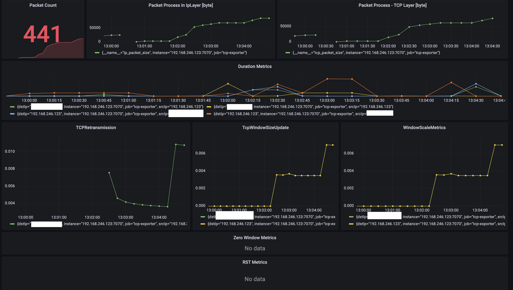

# binocular

This is a project that contains important tcp metrics shown at below;

* TCP Retransmission
* TCP ZeroWindow
* TCP Duration metrics

This metric exporter is responsible to listen interfaces on the workload and produce metrics based on the analysis.

## Prometheus Metrics

Metrics example this metric exporter works like that;

```sh
    #!/bin/bash

    pushd binocular 
        go build .
        ./tcpdump_exporter -p 9090 -i eni-123123
    popd
```

After you build and run this application it will start to produce metrics like that

```sh
# TYPE duration_metric counter
duration_metric{dstIp="<<DST_IP_ADDR>>",srcIp="<<SRC_IP_ADDR>>"} 3.0313016523275064e+18
...
..
.
# TYPE retransmission_metric counter
retransmission_metric{dstIp="<<DST_IP_ADDR>>",srcIp="<<SRC_IP_ADDR>>"} 73

```

## Grafana Dashboard

</img>


## TODO;

* Add more detailed metrics
* Bytes to processed
* K8S Daemonset
* Controller
* Better dashboard